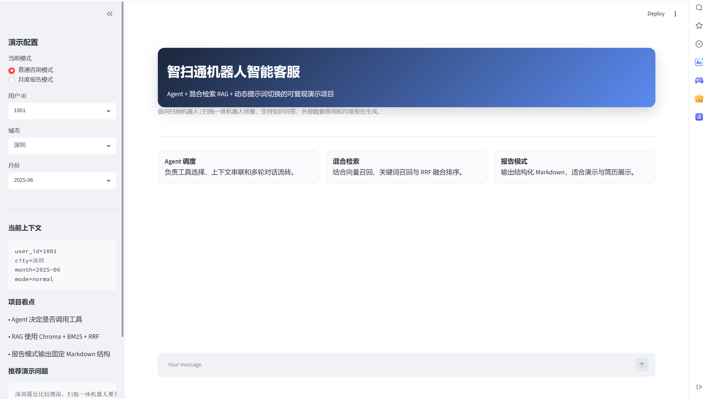
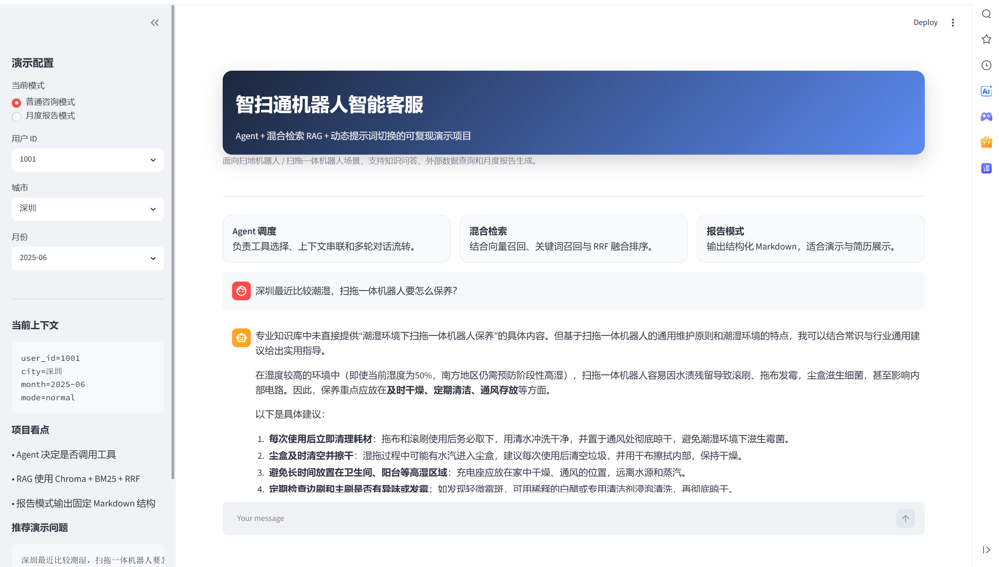
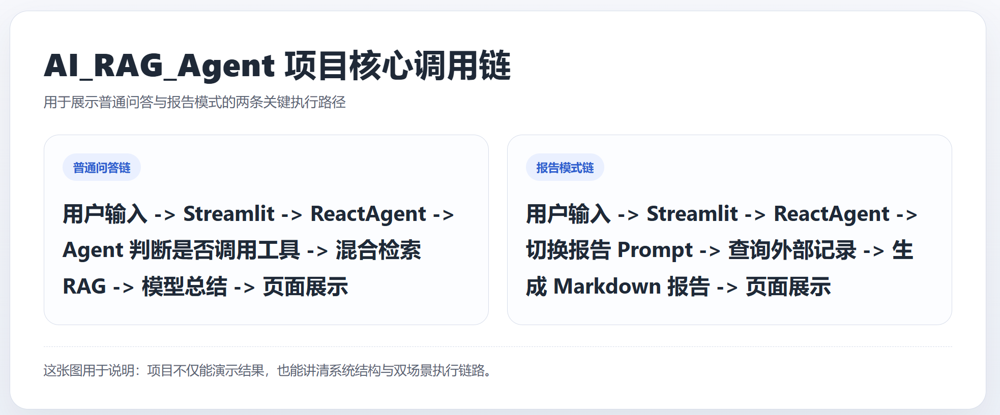

# 智扫通机器人智能客服 Agent

一个面向扫地机器人 / 扫拖一体机器人场景的智能客服项目，基于 `LangChain + Agent + 混合检索 RAG + Streamlit` 构建，支持知识问答、外部使用记录查询、动态提示词切换和结构化月度报告生成。

## 项目亮点

- `Agent` 负责判断是否调用工具，而不是固定的“提问-检索-总结”流程。
- `RAG` 采用 `Chroma + BM25 + RRF` 的轻量混合检索，兼顾语义召回和关键词命中。
- `Streamlit` 提供稳定可复现的演示页面，支持固定 `user_id / city / month / mode`。
- 报告模式输出固定 `Markdown` 结构，适合截图展示、讲解和简历表达。

## 一句话概括

> 基于 LangChain Agent 和混合检索 RAG 构建的扫地机器人智能客服系统，支持知识问答、外部数据查询、动态提示词切换和月度使用报告生成。

## 核心能力

- 普通知识问答
- 月度使用报告生成
- 混合检索 RAG
- 动态提示词切换
- 多轮对话上下文

## 技术栈

- Python
- Streamlit
- LangChain Agent
- LangGraph middleware/runtime
- Chroma
- BM25 Retriever
- DashScope Embeddings
- Tongyi Chat Model

## 项目截图

### 1. 首页总览



### 2. 普通知识问答


### 3. 月度报告模式



### 4. 核心调用链



## 核心链路

### 普通知识问答

```text
用户输入 -> Streamlit -> ReactAgent -> Agent 判断是否调用工具 -> 混合检索 RAG -> 模型总结 -> 页面展示
```

### 月度报告

```text
用户输入 -> Streamlit -> ReactAgent -> 切换报告 Prompt -> 查询外部记录 -> 生成 Markdown 报告 -> 页面展示
```

## 运行方式

```powershell
cd D:\github\RAG_and_Agent\AI_RAG_Agent
python -m rag.vector_store
python -m streamlit run app.py
```

## 推荐演示问题

### 普通咨询

- `深圳最近比较潮湿，扫拖一体机器人要怎么保养？`
- `小户型适合什么类型的扫地机器人？`

### 月度报告

- `给我生成这个月的使用报告`
- `结合本月表现，给我一些保养建议`

## 简历亮点

- 基于 `LangChain + Agent + RAG` 构建扫地机器人智能客服系统，支持知识问答、外部数据查询、动态提示词切换和结构化月度报告生成。
- 基于 `Chroma + BM25 + RRF` 实现轻量混合检索，兼顾语义召回与关键词匹配，提升问答稳定性。
- 使用 `Streamlit` 搭建可复现演示页面，支持多轮对话、固定上下文和报告模式切换，便于项目展示和功能验证。

## 后续可选

- 轻量补一个 `FastAPI` 接口层
- 补充基础测试
- 增强会话存储和历史管理
- 继续完善演示视频与项目讲解稿

